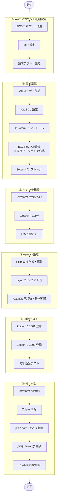

# 手順チェックリスト

## 全体の流れ

<details>
<summary>フローチャートを表示</summary>



</details>

---

## ① AWSアカウント初期設定

- [ ] **AWSアカウントを作成する**
  - https://aws.amazon.com/jp/ でアカウント登録
  - クレジットカード登録が必要（フリーティア範囲内なら無料）

- [ ] **ルートアカウントに MFA を設定する**（不正ログイン防止）
  - AWS コンソール右上のアカウント名 →「セキュリティ認証情報」
  - 「多要素認証（MFA）」→「MFA デバイスを割り当てる」
  - スマホの認証アプリ（Google Authenticator など）でスキャンして登録

- [ ] **請求アラートを設定する**（不正利用の早期発見）
  - AWS コンソール →「Budgets」を検索 →「予算を作成」
  - 「ゼロ支出予算」を選択（$0.01 を超えたら通知）
  - 通知先メールアドレスを入力して作成

---

## ② 事前準備

- [ ] **IAM ユーザーを作成する**（ルートアカウントのキーは使わないこと）
  - AWS コンソール → IAM → ユーザー → 「ユーザーの作成」
  - ユーザー名を決める（例: `terraform-user`）
  - 「AWS マネジメントコンソールへのアクセス」は不要
  - 権限: 「既存のポリシーを直接アタッチ」→ `AdministratorAccess`（学習用）
  - 作成後 → 「セキュリティ認証情報」タブ → 「アクセスキーの作成」
  - 用途: 「コマンドラインインターフェース（CLI）」を選択
  - アクセスキー ID とシークレットアクセスキーを安全な場所に保存

- [ ] **AWS CLI をインストール・設定する**
  ```bash
  # インストール（Mac）
  brew install awscli

  # 設定（上で作成した IAM ユーザーのアクセスキーを入力）
  aws configure
  # AWS Access Key ID: （IAM ユーザーのキー ID）
  # AWS Secret Access Key: （IAM ユーザーのシークレット）
  # Default region name: ap-northeast-1
  # Default output format: json

  # 動作確認
  aws sts get-caller-identity
  ```

- [ ] **Terraform をインストールする**
  ```bash
  brew tap hashicorp/tap
  brew install hashicorp/tap/terraform

  # 確認
  terraform version
  ```

- [ ] **EC2 Key Pair を作成する**
  - AWS コンソール右上のリージョンを **「アジアパシフィック（東京）」** に変更する
    > デフォルトは「米国東部（バージニア北部）」になっていることが多いため注意
  - EC2 → 左メニュー「キーペア」→「キーペアの作成」
  - 名前を決める（例: `asterisk-key`）
  - `.pem` ファイルをダウンロードして `~/.ssh/` に保存
  ```bash
  mv ~/Downloads/asterisk-key.pem ~/.ssh/
  chmod 400 ~/.ssh/asterisk-key.pem
  ```

- [ ] **Zoiper をインストールする**
  - スマートフォン: App Store / Google Play で「Zoiper」を検索してインストール（無料版で可）
  - PC: https://www.zoiper.com/en/voip-softphone/download/current からダウンロード

---

## ③ インフラ構築

- [ ] **自分の IP アドレスを確認する**
  ```bash
  curl https://checkip.amazonaws.com
  # 例: 203.0.113.1
  ```

- [ ] **terraform.tfvars を作成する**
  ```bash
  cp terraform/terraform.tfvars.example terraform/terraform.tfvars
  ```
  `terraform/terraform.tfvars` を編集:
  ```hcl
  my_ip    = "203.0.113.1/32"   # ↑ で確認したIP + /32
  key_name = "asterisk-key"      # 作成した Key Pair 名
  ```

- [ ] **Terraform を初期化する**
  ```bash
  terraform -chdir=terraform init
  ```

- [ ] **作成されるリソースを確認する（plan）**
  ```bash
  terraform -chdir=terraform plan
  ```

- [ ] **インフラを構築する（apply）**
  ```bash
  terraform -chdir=terraform apply
  # "yes" を入力して実行
  ```
  → 完了後に `elastic_ip` が表示されます（例: `13.112.xxx.xxx`）

- [ ] **EC2 が SSH 接続できるまで待つ**（apply 完了後 1〜2 分）
  ```bash
  bash scripts/wait-for-ssh.sh <EIP> ~/.ssh/asterisk-key.pem
  ```

---

## ④ Asterisk設定

- [ ] **Asterisk のインストール完了を待つ**（apply 後 10〜15 分）
  ```bash
  # ログを確認（"インストール完了" が出たらOK）
  ssh -i ~/.ssh/asterisk-key.pem ubuntu@<EIP> "tail -f /var/log/asterisk-install.log"
  ```

- [ ] **pjsip.conf を作成する**
  ```bash
  cp asterisk/pjsip.conf.template asterisk/pjsip.conf
  ```
  `asterisk/pjsip.conf` を編集:
  - `<ELASTIC_IP>` を apply で出力された IP に置き換える（2箇所）
  - `<STRONG_PASSWORD_1001>` と `<STRONG_PASSWORD_1002>` を強いパスワードに変更
    ```bash
    # パスワード生成の例
    openssl rand -base64 16
    ```
  編集後、プレースホルダーが残っていないか確認する:
  ```bash
  grep "<" asterisk/pjsip.conf
  # 何も表示されなければOK
  ```

- [ ] **設定ファイルを EC2 に転送する**
  ```bash
  # --rsync-path="sudo rsync": /etc/asterisk/ は asterisk:asterisk 所有のため sudo が必要
  rsync -av --rsync-path="sudo rsync" -e "ssh -i ~/.ssh/asterisk-key.pem" asterisk/ ubuntu@<EIP>:/etc/asterisk/
  ssh -i ~/.ssh/asterisk-key.pem ubuntu@<EIP> "sudo systemctl restart asterisk"
  ```

- [ ] **Asterisk の動作を確認する**
  ```bash
  ssh -i ~/.ssh/asterisk-key.pem ubuntu@<EIP> "sudo asterisk -rx 'pjsip show endpoints'"
  # 1001 と 1002 が表示されればOK
  ```

---

## ⑤ 通話テスト

- [ ] **Zoiper（スマホ）に 1001 を登録する**
  - アカウント追加 → SIP を選択
  - ユーザー名: `1001`
  - パスワード: pjsip.conf で設定した 1001 のパスワード
  - サーバー: `<Elastic IP>`
  - ポート: `5060` / UDP
  - 「Registered」と表示されれば成功

- [ ] **Zoiper（PC）に 1002 を登録する**
  - 同様に 1002 で登録

- [ ] **通話テストをする**
  - スマホ（1001）から PC（1002）にダイヤル
  - PC 側に着信が来れば完了！

---

## ⑥ 後片付け

- [ ] **インフラを削除する**
  ```bash
  terraform -chdir=terraform destroy
  # "yes" を入力して実行
  ```
  > **注意**: インスタンスを「停止（stop）」するだけでは不十分です。Elastic IP はインスタンスに関連付けられていても、インスタンスが停止中は課金（$0.005/時間）が発生します。学習が終わったら必ず `destroy` してください。

- [ ] **Zoiper をアンインストールする**（任意）
  - スマートフォン: アプリを長押し → 削除
  - PC（Mac）: Zoiper5.app をゴミ箱に移動

- [ ] **pjsip.conf を削除する**
  ```bash
  rm asterisk/pjsip.conf
  ```
  パスワードを含むファイルのため、不要になったら削除してください。

- [ ] **terraform.tfvars を削除する**
  ```bash
  rm terraform/terraform.tfvars
  ```

- [ ] **AWS キーペアを削除する**
  - AWS コンソール → EC2 → 左メニュー「キーペア」
  - `asterisk-key` を選択 → 「アクション」→「削除」

- [ ] **ローカルの秘密鍵を削除する**
  ```bash
  rm ~/.ssh/asterisk-key.pem
  ```

- [ ] **ローカルのプロジェクトフォルダを削除する**（任意）
  - Finder またはターミナルで `asterisk-learning` フォルダをゴミ箱へ
  > このファイル自体もフォルダ内にあるため、削除は最後に行うこと。GitHub のリモートリポジトリはそのまま残ります。

---

## 拡張（任意）: Twilio で実番号発着信

- [ ] Twilio アカウントを作成する（無料トライアルで可）
- [ ] 電話番号を取得する
- [ ] pjsip.conf に Twilio SIP トランクを追加する
- [ ] extensions.conf に発着信のダイヤルプランを追加する
